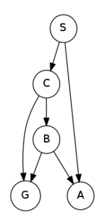
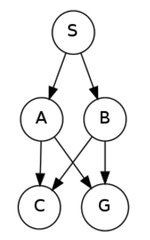
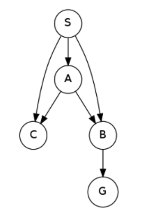
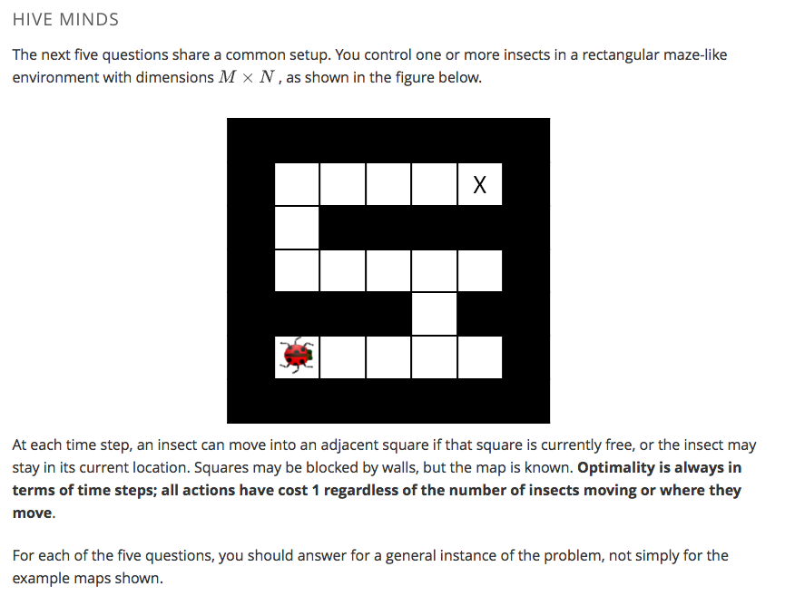

### Question 1: Search Trees
### How many nodes are in the complete search tree for the given state space graph? The start state is S. You may find it helpful to draw out the search tree on a piece of paper.

S

S -> A
S -> C

S -> A
S -> C -> B
S -> C -> G

S -> C -> B -> G

**7**

*****
### Question 2: Depth-First Graph Search
### Consider a depth-first graph search on the graph below, where S is the start and G is the goal state. Assume that ties are broken alphabetically (so a partial plan S->X->A would be expanded before S->X->B and S->A->Z would be expanded before S->B->A). You may find it helpful to execute the search on scratch paper.

### Please enter the final path returned by depth-first graph search in the box below. Your answer should be a string with S as your first character and G as your last character. Don't include arrows or spaces in your submission. For example, if you believe the path is S->X->G, please enter SXG in the box.

**SAG**

*****
### Question 3: Breadth-First Graph Search

### Consider a breadth-first graph search on the graph below, where S is the start and G is the goal state. Assume that ties are broken alphabetically (so a partial plan S->X->A would be expanded before S->X->B and S->A->Z would be expanded before S->B->A). You may find it helpful to execute the search on scratch paper.

### Please enter the final path returned by breadth-first graph search in the box below. Your answer should be a string with S as your first character and G as your last character. Don't include arrows or spaces in your submission. For example, if you believe the path is S->X->G, please enter SXG in the box.

**SBG**

*****
### Question 2: Depth-First Graph Search
### Consider a depth-first graph search on the graph below, where S is the start and G is the goal state. Assume that ties are broken alphabetically (so a partial plan S->X->A would be expanded before S->X->B and S->A->Z would be expanded before S->B->A). You may find it helpful to execute the search on scratch paper.

### Please enter the final path returned by depth-first graph search in the box below. Your answer should be a string with S as your first character and G as your last character. Don't include arrows or spaces in your submission. For example, if you believe the path is S->X->G, please enter SXG in the box.

**SAG**

*****
### Question 4: A* Graph Search

### Consider A* graph search on the graph below. Arcs are labeled with action costs and states are labeled with heuristic values. Assume that ties are broken alphabetically (so a partial plan S->X->A would be expanded before S->X->B and S->A->Z would be expanded before S->B->A.

### In what order are states expanded by A* graph search? You may find it helpful to execute the search on scratch paper.

f(S -> A) = 5 
f(S -> B) = 4 &nbsp;&nbsp;&nbsp;&nbsp;&nbsp;\*\*expand\*\*

f(S -> A) = 5 &nbsp;&nbsp;&nbsp;&nbsp;&nbsp;\*\*expand\*\* 
f(S -> B -> D) = 8 
f(S -> B -> Goal) = 11

f(S -> A -> B) | *already expanded* 
f(S -> A -> C) = 6 
f(S -> A -> D) = 5 &nbsp;&nbsp;&nbsp;&nbsp;&nbsp;\*\*expand\*\* 
f(S -> B -> D) = 8 
f(S -> B -> Goal) = 11

f(S -> A -> C) = 6 
**f(S -> A -> D -> Goal) = 7** 
f(S -> B -> D) = 8 
f(S -> B -> Goal) = 11

Exploration Order: **Start, B, A, D, C, Goal**

What path does A* graph search return?
**Start-A-D-Goal**
*****

### Question 5: Hive Minds: Lonely Bug

### You control a single insect as shown in the maze below, which must reach a designated target location X, also known as the hive. There are no other insects moving around.

Which of the following is a minimal correct state space representation?

**A tuple (x,y) encoding the x and y coordinates of the insect.**

What is the size of the state space?
**M N**

Which of the following heuristics are admissible (if any)?

** Manhattan distance from the insect's location to the hive.** 
** Euclidean distance from the insect's location to the hive.**
