### Question 1: Search Trees
### How many nodes are in the complete search tree for the given state space graph? The start state is S. You may find it helpful to draw out the search tree on a piece of paper.

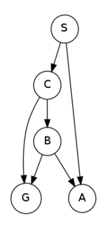

S

S -> A
S -> C

S -> A
S -> C -> B
S -> C -> G

S -> C -> B -> G

**7**

*****
### Question 2: Depth-First Graph Search
### Consider a depth-first graph search on the graph below, where S is the start and G is the goal state. Assume that ties are broken alphabetically (so a partial plan S->X->A would be expanded before S->X->B and S->A->Z would be expanded before S->B->A). You may find it helpful to execute the search on scratch paper.

### Please enter the final path returned by depth-first graph search in the box below. Your answer should be a string with S as your first character and G as your last character. Don't include arrows or spaces in your submission. For example, if you believe the path is S->X->G, please enter SXG in the box.

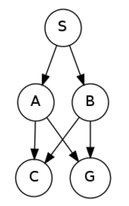

**SAG**

*****
### Question 3: Breadth-First Graph Search

### Consider a breadth-first graph search on the graph below, where S is the start and G is the goal state. Assume that ties are broken alphabetically (so a partial plan S->X->A would be expanded before S->X->B and S->A->Z would be expanded before S->B->A). You may find it helpful to execute the search on scratch paper.

### Please enter the final path returned by breadth-first graph search in the box below. Your answer should be a string with S as your first character and G as your last character. Don't include arrows or spaces in your submission. For example, if you believe the path is S->X->G, please enter SXG in the box.

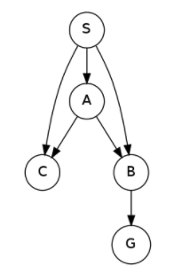

**SBG**

*****
### Question 2: Depth-First Graph Search
### Consider a depth-first graph search on the graph below, where S is the start and G is the goal state. Assume that ties are broken alphabetically (so a partial plan S->X->A would be expanded before S->X->B and S->A->Z would be expanded before S->B->A). You may find it helpful to execute the search on scratch paper.

### Please enter the final path returned by depth-first graph search in the box below. Your answer should be a string with S as your first character and G as your last character. Don't include arrows or spaces in your submission. For example, if you believe the path is S->X->G, please enter SXG in the box.

**SAG**

*****
### Question 4: A* Graph Search

### Consider A* graph search on the graph below. Arcs are labeled with action costs and states are labeled with heuristic values. Assume that ties are broken alphabetically (so a partial plan S->X->A would be expanded before S->X->B and S->A->Z would be expanded before S->B->A.

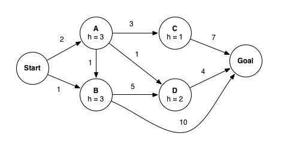

### In what order are states expanded by A* graph search? You may find it helpful to execute the search on scratch paper.

f(S -> A) = 5 
f(S -> B) = 4 &nbsp;&nbsp;&nbsp;&nbsp;&nbsp;\*\*expand\*\*

f(S -> A) = 5 &nbsp;&nbsp;&nbsp;&nbsp;&nbsp;\*\*expand\*\* 
f(S -> B -> D) = 8 
f(S -> B -> Goal) = 11

f(S -> A -> B) | *already expanded* 
f(S -> A -> C) = 6 
f(S -> A -> D) = 5 &nbsp;&nbsp;&nbsp;&nbsp;&nbsp;\*\*expand\*\* 
f(S -> B -> D) = 8 
f(S -> B -> Goal) = 11

f(S -> A -> C) = 6 
**f(S -> A -> D -> Goal) = 7** 
f(S -> B -> D) = 8 
f(S -> B -> Goal) = 11

Exploration Order: **Start, B, A, D, C, Goal**

What path does A* graph search return?
**Start-A-D-Goal**
*****
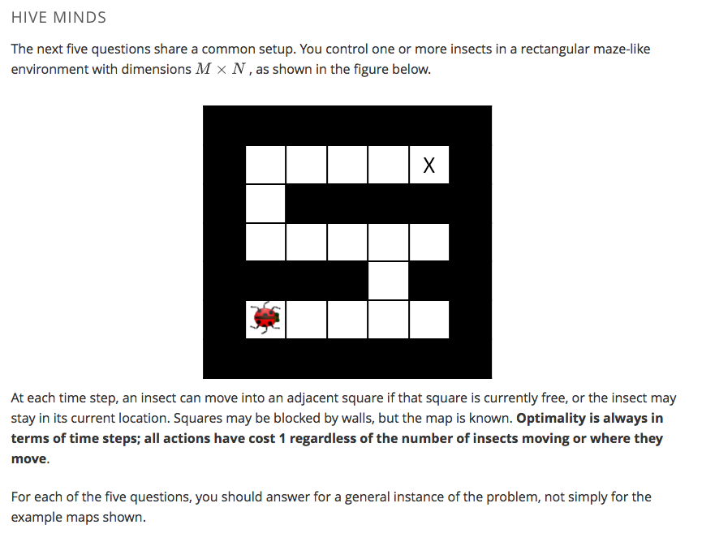

### Question 5: Hive Minds: Lonely Bug

### You control a single insect as shown in the maze below, which must reach a designated target location X, also known as the hive. There are no other insects moving around.

Which of the following is a minimal correct state space representation?

**A tuple (x,y) encoding the x and y coordinates of the insect.**

What is the size of the state space?
**M N**

Which of the following heuristics are admissible (if any)?

** Manhattan distance from the insect's location to the hive.** 
** Euclidean distance from the insect's location to the hive.**

*****
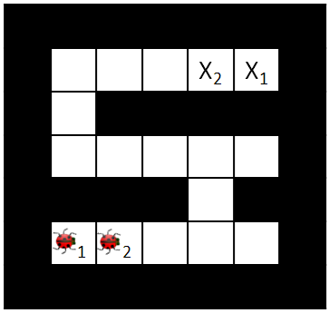

### Question 6: Hive Minds: Swarm Movement

### You control K insects, each of which has a specific target ending location Xk. No two insects may occupy the same square. In each time step all insects move simultaneously to a currently free square (or stay in place); adjacent insects cannot swap in a single time step.

Which of the following is a minimal correct state space representation?

**K tuples ((x1, y1), (x2, y2), ..., (xK, yK)) encoding the x and y coordinates of each insect.**

What is the size of the state space?

**(MN)K**

Which of the following heuristics are admissible (if any)?

- **Max of Manhattan distances from each insect's location to its target location.**
- **Max of costs of optimal paths for each insect to its goal if it were acting alone in the environment, unobstructed by the other insects.**

*****
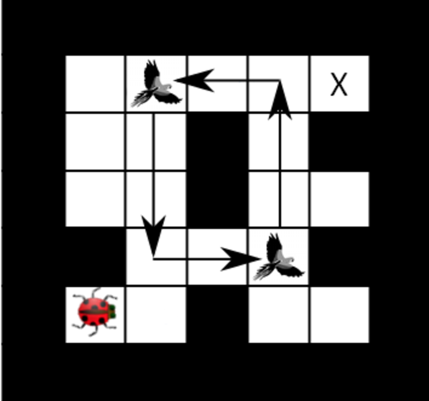

### Question 7: Hive Minds: Migrating Birds

### You again control a single insect, but there are B birds flying along known paths. Specifically, at time t each bird b will be at position (xb(t),yb(t)). The tuple of bird positions repeats with period T. Birds might move up to 3 squares per time step. An example is shown below, but keep in mind that you should answer for a general instance of the problem, not simply the map and path shown above.

### Your insect can share squares with birds and it can even hitch a ride on them! On any time step that your insect shares a square with a bird, the insect may either move as normal or move directly to the bird’s next location (either action has cost 1, even if the bird travels farther than one square).

Which of the following is a minimal state representation?

**A tuple (x,y) giving the position of the insect, plus an integer r=t mod T where t is the time step.**

Which of the following is the size of the state space?

**MNT**

Which of the following heuristics are admissible (if any)?

- **Manhattan distance from the insect's current position to the target divided by three.**

*****
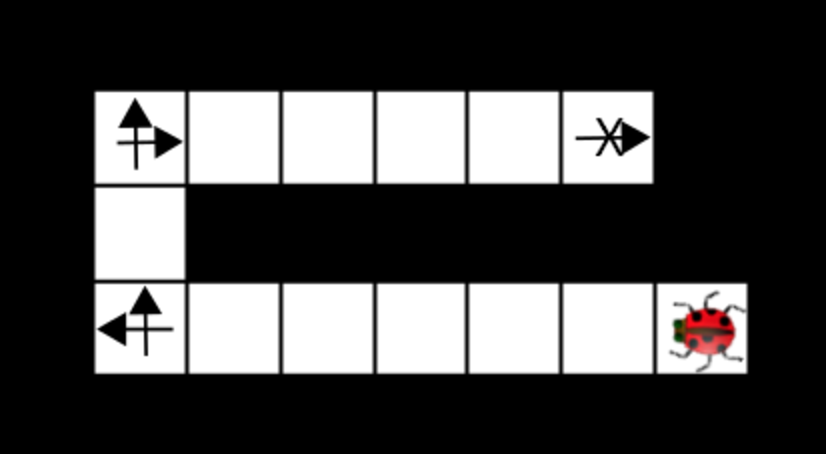

### Question 8: Hive Minds: Jumping Bug

### Your single insect is alone in the maze again. This time, it has super legs that can take it as far as you want in a straight line in each time step. The disadvantage of these legs is that they make turning slower, so now it takes the insect a time step to change the direction it is facing. Moving v squares requires that all intermediate squares passed through, as well as the vth square, currently be empty. The cost of a multi-square move is still 1 time unit, as is a turning move. As an example, the arrows in the maze below indicate where the insect will be and which direction it is facing after each time step in the optimal (fewest time steps) plan (cost 5):

Which of the following is a minimal state representation?

** A tuple (x,y) giving the position of the insect, plus the direction the insect is facing.**

What is the size of the state space?

**4MN**

*****
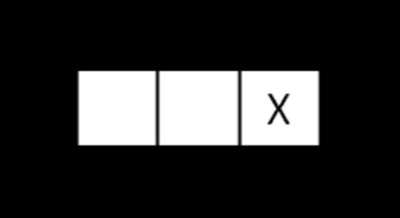

### Question 9: Hive Minds: Lost at Night

### It is night and you control a single insect. You know the maze, but you do not know what square the insect will start in. You must pose a search problem whose solution is an all-purpose sequence of actions such that, after executing those actions, the insect will be on the exit square, regardless of initial position. The insect executes the actions mindlessly and does not know whether its moves succeed: if it uses an action which would move it in a blocked direction, it will stay where it is. For example, in the maze below, moving right twice guarantees that the insect will be at the exit regardless of its starting position.

Which of the following state representations could be used to solve this problem?

**A list of boolean variables, one for each position in the maze, indicating whether the insect could be in that position.**

What is the size of the state space?

**2MN**

Which of the following are admissible heuristics?
- **The maximum of Manhattan distances to the goal from each possible location the insect could be in.**
- **The minimum of Manhattan distances to the goal from each possible location the insect could be in.**

*****
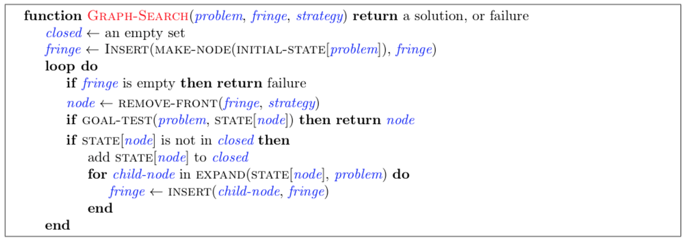
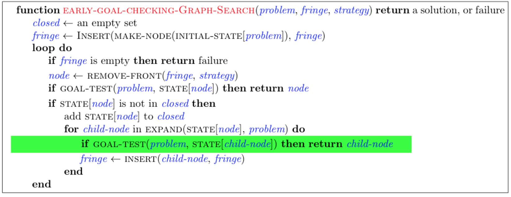

### Question 10: Early Goal Checking Graph Search

### Recall from lecture the general algorithm for GRAPH-SEARCH reproduced below.

### With the above implementation a node that reaches a goal state may sit on the fringe while the algorithm continues to search for a path that reaches a goal state. Let's consider altering the algorithm by testing whether a node reaches a goal state when inserting into the fringe. Concretely, we add the line of code highlighted below:

### Now, we've produced a graph search algorithm that can find a solution faster. However, In doing so we might have affected some properties of the algorithm. To explore the possible differences, consider the example graph below.

If using EARLY-GOAL-CHECKING-GRAPH-SEARCH with a Uniform Cost node expansion strategy, which path, if any, will the algorithm return?

**S-G**

If using EARLY-GOAL-CHECKING-GRAPH-SEARCH with an A* node expansion strategy, which path, if any, will the algorithm return?

**S-G**

Assume you run EARLY-GOAL-CHECKING-GRAPH-SEARCH with the Uniform Cost node expansion strategy, select all statements that are true.

- **The EXPAND function can be called at most once for each state.**
- **The algorithm is complete.**

Assume you run EARLY-GOAL-CHECKING-GRAPH-SEARCH with the A* node expansion strategy and a consistent heuristic, select all statements that are true.

- **The EXPAND function can be called at most once for each state.**
- **The algorithm is complete.**
